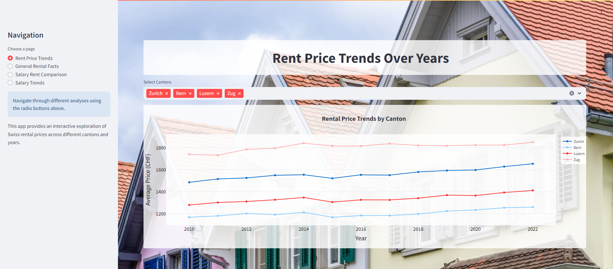

# Swiss Rent and Salary Trends

A data-driven analysis of rental prices and salary trends across Switzerland, highlighting regional disparities and changes over time.
Overview
This project provides a comprehensive analysis of rental price trends and salary patterns across various regions in Switzerland. The data, gathered from multiple sources, allows for a comparison of rent and salary growth across different time periods and regions. Using this analysis, we can explore how salary increases align (or fail to align) with rising living costs, offering valuable insights into affordability in Swiss regions.

# Features

- Interactive Dashboard: Visualize salary and rent trends with an easy-to-use interface.
- Region Comparison: Compare rent and salary changes across Swiss cantons and regions over multiple years.
- Data-Driven Insights: Generate insights on the affordability gap between salary increases and rent hikes.
- Customizable Analysis: Select regions and years for a more personalized data analysis experience.

# Technologies

- Python: Data processing and visualization.
- Pandas: Data manipulation and merging.
- Streamlit: Interactive web application framework for creating the dashboard.
- Plotly: Dynamic visualizations and graphs.
- Excel: Data storage format for rental prices and salary trends.
- Data Sources
- Swiss Rental Prices: Historical rental price data categorized by region and building construction year.
- Swiss Salary Trends: Yearly salary data categorized by Swiss regions.

## Data Source

The salaries data in this dashboard is sourced from the [Bundesamt für Statistik](https://www.bfs.admin.ch/bfs/de/home/statistiken/arbeit-erwerb/loehne-erwerbseinkommen-arbeitskosten/lohnstruktur.html)
The rent data used in this dashboard is sourced from the [Bundesamt für Statistik](https://www.bfs.admin.ch/bfs/de/home/statistiken/bau-wohnungswesen/wohnungen/mietwohnungen.html)
